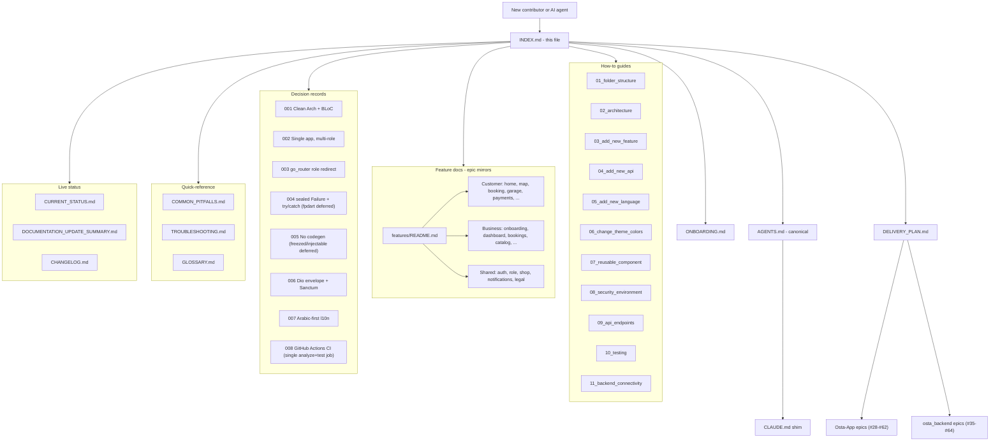

# Documentation Index / فهرس التوثيق

> The entry point for everyone — humans and AI agents alike. Pick the task that matches you, follow the link, and you'll have the right context loaded in under a minute.

> ‏نقطة البداية للجميع — بشرًا وعملاء ذكاء اصطناعي على حدٍّ سواء. اختر المهمة المطابقة لك، اتبع الرابط، وستحصل على السياق الصحيح في أقل من دقيقة.

> The codebase runs on **plain Dart with no code generation** — plain `Equatable` models with hand-written `fromJson`/`toJson`, manual `get_it` registration, and a sealed `Failure` + `try`/`catch` error model. Advanced tooling (freezed, injectable, fpdart, build flavors, platform CI jobs) is **deferred, not rejected**; the phased plan lives in [`../docs/ROADMAP.md`](../docs/ROADMAP.md). Only localization is generated.

> ‏تعتمد الشيفرة على **Dart بسيط بدون توليد كود** — نماذج `Equatable` عادية مع `fromJson`/`toJson` مكتوبة يدويًا، وتسجيل يدوي في `get_it`، ونموذج أخطاء يعتمد على `Failure` مُختوم مع `try`/`catch`. الأدوات المتقدّمة (freezed وinjectable وfpdart وحزم البناء ومهام الـ CI لكل منصّة) **مؤجّلة وليست مرفوضة**، والخطة المرحلية موجودة في [`../docs/ROADMAP.md`](../docs/ROADMAP.md). التوليد الوحيد الباقي هو الترجمة (l10n).

## I want to … / أريد أن …

### … get started on this codebase / أبدأ العمل على هذه الشيفرة

- [ONBOARDING.md](reference/ONBOARDING.md) — Day-1 checklist + "Where to look for X" map.
- [`../README.md`](../README.md) — High-level pitch, setup, single `BASE_URL` config, CI.
- [`../AGENTS.md`](../AGENTS.md) — Canonical project conventions (the everything-doc).

> ‏قائمة اليوم الأول وخريطة "أين أبحث عن كذا"، ثم النبذة التعريفية والإعداد وضبط `BASE_URL` الواحد والـ CI، وأخيرًا اصطلاحات المشروع المرجعية.

### … know what to build next / أعرف ما الذي أبنيه تاليًا

- [DELIVERY_PLAN.md](reference/DELIVERY_PLAN.md) — Milestones, owners, cross-repo issue map, suggested build order.
- App tracker [#61](https://github.com/YoussefSalem582/Osta-App/issues/61) · Backend tracker [#63](https://github.com/YoussefSalem582/osta_backend/issues/63).
- [CURRENT_STATUS.md](CURRENT_STATUS.md) — What exists today (M0 foundation) + metrics.

> ‏المعالم والمسؤولون وخريطة القضايا عبر المستودعات وترتيب البناء المقترح، مع متتبّعات القضايا، ولقطة لما هو موجود اليوم (أساس M0) والمقاييس.

### … understand a single feature in depth / أفهم ميزة واحدة بعمق

- [features/](features/README.md) — One doc per feature area, matched 1:1 to the GitHub epics: scope, mockups, endpoints, planned architecture, testing expectations. Most features are **specs, not shipped code** — the doc tells you which.

> ‏مستند واحد لكل مجال ميزة، مطابق واحدًا لواحد لملاحم GitHub: النطاق والتصاميم ونقاط النهاية والبنية المخطّطة وتوقعات الاختبار. معظم الميزات **مواصفات وليست كودًا مُسلَّمًا** — والمستند يوضّح أيّها.

### … add a new feature / أضيف ميزة جديدة

- [03_how_to_add_new_feature.md](guides/03_how_to_add_new_feature.md) — Step-by-step (layers → DI → routing → l10n → tests).
- [02_architecture.md](guides/02_architecture.md) — Clean Architecture + BLoC refresher with the request-lifecycle diagram.

> ‏دليل خطوة بخطوة (الطبقات ← الحقن اليدوي في `get_it` ← التوجيه ← الترجمة ← الاختبارات)، مع مراجعة للمعمارية النظيفة ونمط BLoC ومخطّط دورة حياة الطلب.

### … wire a new backend endpoint / أوصّل نقطة نهاية خلفية جديدة

- [04_how_to_add_new_api.md](guides/04_how_to_add_new_api.md) — Envelope, `ApiClient`, exception → failure mapping, worked example.
- [09_api_endpoints.md](guides/09_api_endpoints.md) — Full endpoint catalogue with App Status column.
- [11_backend_feature_connectivity.md](guides/11_backend_feature_connectivity.md) — Which backend epics are ready vs blocked, app ↔ backend mirror.

> ‏الغلاف و`ApiClient` وربط الاستثناء المُصنّف بـ `Failure` مع مثال عملي، ثم كتالوج نقاط النهاية الكامل، وأخيرًا أيّ ملاحم الخلفية جاهزة أو محجوبة ومرآة التطبيق مقابل الخلفية.

### … add or change a translation / أضيف أو أعدّل ترجمة

- [05_how_to_add_new_language.md](guides/05_how_to_add_new_language.md) — ARB pipeline, `gen-l10n`, Arabic-first + RTL rules.

> ‏خطّ أنابيب ملفات ARB وأمر `gen-l10n` وقواعد العربية أولًا والاتجاه من اليمين لليسار. الترجمة هي الكود الوحيد الذي يُولَّد في المشروع.

### … change theme colours or design tokens / أغيّر ألوان الثيم أو رموز التصميم

- [06_how_to_change_theme_colors.md](guides/06_how_to_change_theme_colors.md) — Token locations, light/dark cascade, contrast test.
- [`../AGENTS.md`](../AGENTS.md) § Design Tokens — Quick-reference table.

> ‏مواقع الرموز وتسلسل الوضع الفاتح/الداكن واختبار التباين، مع جدول مرجعي سريع لرموز التصميم.

### … build a reusable widget / أبني عنصر واجهة قابلًا لإعادة الاستخدام

- [07_how_to_create_reusable_component.md](guides/07_how_to_create_reusable_component.md) — `lib/shared/ui/` conventions + existing catalogue.

> ‏اصطلاحات مجلّد `lib/shared/ui/` والكتالوج الحالي للعناصر المشتركة.

### … add a secret / environment value / أضيف سرًّا أو قيمة بيئة

- [08_security_and_environment.md](guides/08_security_and_environment.md) — `--dart-define` + `AppConfig`, token storage, logging redaction.

> ‏استخدام `--dart-define` مع `AppConfig` وتخزين الرموز وحجب البيانات الحسّاسة في السجلّات.

### … write tests / أكتب اختبارات

- [10_testing.md](guides/10_testing.md) — Current suite, tooling, golden/widget/unit conventions, CI gates.

> ‏مجموعة الاختبارات الحالية والأدوات واصطلاحات اختبارات الوحدة والواجهة والـ golden وبوابات الـ CI.

### … understand why something is done this way / أفهم لماذا نُفّذ شيء بهذه الطريقة

- [decisions/](decisions/README.md) — Architecture Decision Records (8 ADRs).
- [COMMON_PITFALLS.md](reference/COMMON_PITFALLS.md) — Don't-X-do-Y reasoning.

> ‏سجلّات قرارات المعمارية (8 سجلّات)، ومنطق "لا تفعل كذا بل افعل كذا" للأخطاء الشائعة.

### … fix a build / runtime problem / أصلح مشكلة بناء أو تشغيل

- [TROUBLESHOOTING.md](reference/TROUBLESHOOTING.md) — Incident recipes (l10n, CI format, 401 loops…).
- [`../CHANGELOG.md`](../CHANGELOG.md) — Did a recent change cause this?

> ‏وصفات حلّ الأعطال (الترجمة وتنسيق الـ CI وحلقات الخطأ 401…)، مع سجلّ التغييرات للتحقق مما إذا كان تغيير حديث هو السبب.

### … look up a project-specific term / أبحث عن مصطلح خاص بالمشروع

- [GLOSSARY.md](reference/GLOSSARY.md) — One-liner per term.

> ‏سطر واحد لكل مصطلح.

## I'm an AI agent — give me the read order / أنا عميل ذكاء اصطناعي — أعطني ترتيب القراءة

1. [`../AGENTS.md`](../AGENTS.md) — canonical conventions.
2. Tool shim if applicable ([`../CLAUDE.md`](../CLAUDE.md)).
3. This INDEX.md to find the right per-task doc.
4. [DELIVERY_PLAN.md](reference/DELIVERY_PLAN.md) + the feature doc + the GitHub epic before writing feature code.
5. [COMMON_PITFALLS.md](reference/COMMON_PITFALLS.md) before generating code; [TROUBLESHOOTING.md](reference/TROUBLESHOOTING.md) when something breaks.

> ‏اقرأ الاصطلاحات المرجعية أولًا، ثم غلاف الأداة إن وُجد، ثم هذا الفهرس لإيجاد المستند المناسب لكل مهمة، ثم خطة التسليم ومستند الميزة وملحمة GitHub قبل كتابة كود الميزة، وأخيرًا الأخطاء الشائعة قبل توليد الكود ودليل استكشاف الأعطال عند حدوث خلل.

## Doc Map / خريطة المستندات

