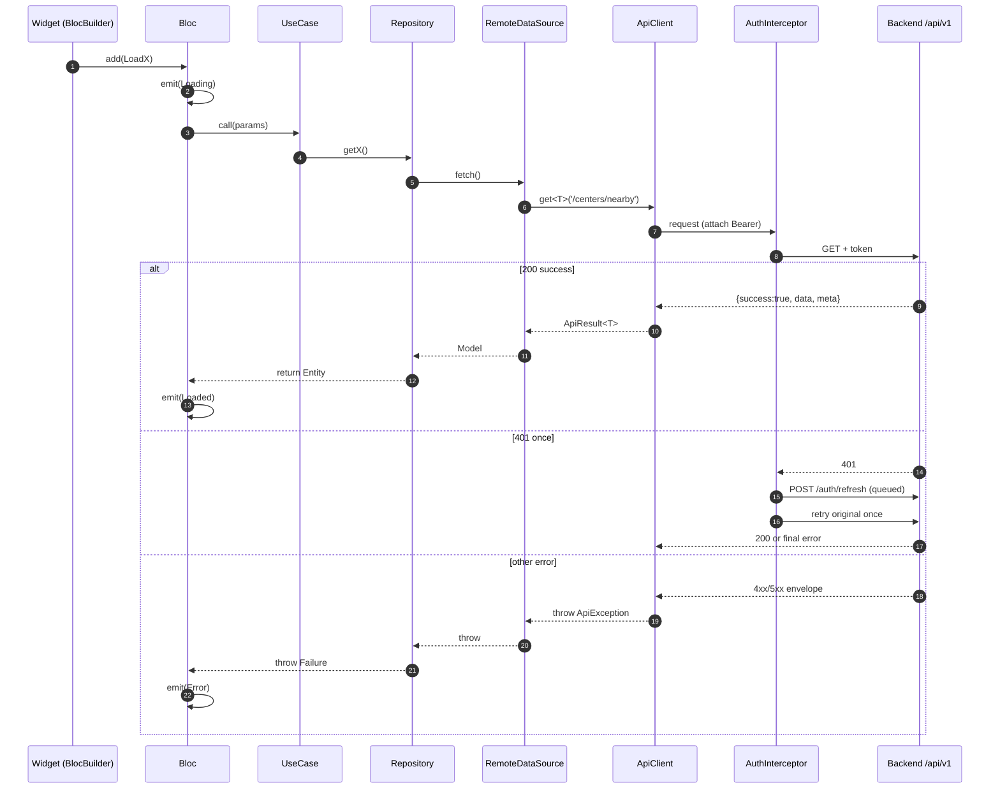

# 🏗️ Architecture

> [INDEX](../INDEX.md) > Architecture

How OSTA is structured: **Clean Architecture + BLoC**, with an envelope-aware networking core and a planned role-shell router. The codebase was deliberately simplified for a team new to Flutter — plain, readable Dart with **no codegen**. Advanced tooling was **deferred, not rejected**; the phased reintroduction plan lives in [docs/ROADMAP.md](../../docs/ROADMAP.md). This guide describes the target architecture and flags what exists today (M0) versus what each feature epic will add.

> ‏دليل يشرح بنية تطبيق OSTA: **Clean Architecture + BLoC**، مع طبقة شبكة تفهم غلاف الاستجابة (envelope) وموجّه (router) مبني على أدوار المستخدم. جرى تبسيط الكود عن قصد ليناسب فريقًا جديدًا على Flutter — كود Dart واضح ومقروء **بدون توليد كود (codegen)**. الأدوات المتقدمة **مؤجّلة وليست مرفوضة**؛ وخطة إعادة إدخالها على مراحل موجودة في [docs/ROADMAP.md](../../docs/ROADMAP.md). يصف هذا الدليل البنية المستهدفة ويوضّح الموجود اليوم (M0) مقابل ما ستضيفه كل ملحمة (epic).

---

## Layers / الطبقات

Every feature is three layers with a strict dependency rule:

> ‏كل ميزة مكوّنة من ثلاث طبقات تحكمها قاعدة اعتماد صارمة:

```
Presentation  →  Domain  ←  Data
(bloc/pages/widgets)   (entities/contracts/usecases)   (models/datasources/repos)
```

- **Domain** — pure Dart, zero Flutter imports. Entities (`Equatable`), abstract repository contracts that **throw** a `Failure` on error, and use-case classes (one operation each).
- **Data** — plain `Equatable` models with hand-written `fromJson`/`toJson` (no annotations), remote data sources that call `ApiClient`, repository implementations that catch `ApiException` and rethrow a `Failure`.
- **Presentation** — BLoCs/Cubits, pages, feature widgets. Reads only the domain layer.

> ‏**Domain** — دارت خالص بدون أي استيراد من Flutter. الكيانات (entities) ترث `Equatable`، وعقود المستودعات المجرّدة **ترمي (throw)** كائن `Failure` عند الخطأ، وأصناف حالات الاستخدام (use-case) بعملية واحدة لكل صنف. أما **Data** فهي نماذج عادية ترث `Equatable` مع دوال `fromJson`/`toJson` مكتوبة يدويًا (بلا تعليقات توضيحية)، ومصادر بيانات بعيدة تستدعي `ApiClient`، وتنفيذات مستودعات تلتقط `ApiException` وتعيد رمي `Failure`. و**Presentation** هي الـ BLoCs/Cubits والصفحات وودجت الميزة، ولا تقرأ إلا من طبقة الـ domain.

Feature folders already exist as **stubs** (`lib/features/customer/*`, `lib/features/business/*`, `shop`, `notifications`, `auth`). Today only `splash`, `role`, and `auth/data/models/auth_token_model.dart` are filled in. The [auth epic (#35)](https://github.com/YoussefSalem582/Osta-App/issues/35) will provide the first end-to-end reference; until then, [03_how_to_add_new_feature.md](03_how_to_add_new_feature.md) is the contract.

> ‏مجلدات الميزات موجودة بالفعل كـ **stubs** (`lib/features/customer/*`، `lib/features/business/*`، `shop`، `notifications`، `auth`). اليوم لم يُملأ فعليًا سوى `splash` و`role` و`auth/data/models/auth_token_model.dart`. وستوفّر [ملحمة auth (#35)](https://github.com/YoussefSalem582/Osta-App/issues/35) أول مرجع كامل من طرف إلى طرف؛ وحتى ذلك الحين يظل [03_how_to_add_new_feature.md](03_how_to_add_new_feature.md) هو العقد المرجعي.

---

## Error handling — sealed `Failure` + try/catch / معالجة الأخطاء

`lib/core/error/failure.dart` defines a sealed `Failure` (`NetworkFailure`, `ServerFailure`, `UnknownFailure`). There is **no** `fpdart`, no `Either`, no `Result<T>`, no `.fold()` — errors flow through plain `try`/`catch`, which keeps the model approachable for a team new to Flutter. Functional error types are deferred (see [docs/ROADMAP.md](../../docs/ROADMAP.md) Phase 5).

> ‏يعرّف الملف `lib/core/error/failure.dart` صنفًا مغلقًا `Failure` (`NetworkFailure`، `ServerFailure`، `UnknownFailure`). **لا يوجد** `fpdart` ولا `Either` ولا `Result<T>` ولا `.fold()` — تتدفق الأخطاء عبر `try`/`catch` عادية، ما يبقي النموذج سهلًا على فريق جديد على Flutter. أنواع الأخطاء الوظيفية (functional) مؤجّلة (انظر [docs/ROADMAP.md](../../docs/ROADMAP.md) المرحلة 5).

```dart
// lib/core/error/failure.dart
sealed class Failure implements Exception {
  const Failure(this.message);
  final String message;
}
class NetworkFailure extends Failure { const NetworkFailure([super.message = 'Network error']); }
class ServerFailure  extends Failure { const ServerFailure([super.message = 'Server error']); }
class UnknownFailure extends Failure { const UnknownFailure([super.message = 'Unexpected error']); }
```

The rule:

> ‏القاعدة:

- The **network layer** throws typed `ApiException`s (see below).
- The **repository** is the boundary: it `try/catch`es `ApiException` and either rethrows or converts it to a `Failure`. Nothing above a repository ever sees Dio or `ApiException`.
- The **BLoC** catches `Failure`:

```dart
try {
  final centers = await getNearbyCenters(params);
  emit(MapLoaded(centers));
} on Failure catch (failure) {
  emit(MapError(failure));
}
```

See [ADR 004](../decisions/004-fpdart-either-error-handling.md).

---

## HTTP lifecycle / دورة حياة طلب HTTP

All HTTP goes through `ApiClient` (`lib/core/network/api_client.dart`), which understands the backend envelope `{success, data, meta}` (success) / `{success:false, error:{code,message,details}}` (failure) and returns `ApiResult<T>` (data + optional `PaginationMeta`) or throws a typed exception.

> ‏كل طلبات HTTP تمرّ عبر `ApiClient` (`lib/core/network/api_client.dart`)، الذي يفهم غلاف الاستجابة من الخادم `{success, data, meta}` (نجاح) / `{success:false, error:{code,message,details}}` (فشل)، ويعيد `ApiResult<T>` (البيانات مع `PaginationMeta` اختياري) أو يرمي استثناءً من نوع محدّد.

The typed exceptions in `api_exception.dart`:

> ‏الاستثناءات ذات الأنواع المحددة في `api_exception.dart`:

| Exception | HTTP | Notes |
|---|---|---|
| `ValidationException` | 422 | carries `fieldErrors` (map field → messages); **bad login is 422, not 401** |
| `UnauthenticatedException` | 401 | normally handled by the interceptor first |
| `ForbiddenException` | 403 | cross-tenant / policy denial |
| `NotFoundException` | 404 | |
| `RateLimitException` | 429 | throttle; may carry `Retry-After` |
| `ServerException` | 5xx | also malformed envelopes |
| `NetworkException` | — | transport (timeout, DNS, refused) |



`AuthInterceptor` is a `QueuedInterceptor`: on 401 it refreshes **once** and retries the original request; concurrent 401s queue behind a single refresh (no refresh storms). A failed refresh emits on `AuthEvents.onSessionExpired` — the app routes to login from there. See [ADR 006](../decisions/006-dio-envelope-client-sanctum.md).

> ‏الـ `AuthInterceptor` هو `QueuedInterceptor`: عند 401 يجدّد التوكن **مرة واحدة** ويعيد إرسال الطلب الأصلي؛ وطلبات الـ 401 المتزامنة تصطف خلف تجديد واحد (بلا عواصف تجديد). وعند فشل التجديد يُطلق حدثًا على `AuthEvents.onSessionExpired` — ومن هناك يوجّه التطبيق إلى شاشة تسجيل الدخول. انظر [ADR 006](../decisions/006-dio-envelope-client-sanctum.md).

---

## Dependency injection / حقن الاعتماديات

`get_it` with **manual** registration — no `injectable`, no `build_runner`, no `injection.config.dart`. `configureDependencies()` (in `lib/core/di/injection.dart`) wires everything at startup with hand-written `registerLazySingleton` / `registerSingleton` lines, exposing a global `getIt`. Annotation-based DI codegen is deferred (see [docs/ROADMAP.md](../../docs/ROADMAP.md) Phases 1–3).

> ‏نستخدم `get_it` مع تسجيل **يدوي** — بلا `injectable` وبلا `build_runner` وبلا `injection.config.dart`. تقوم `configureDependencies()` (في `lib/core/di/injection.dart`) بربط كل شيء عند الإقلاع عبر أسطر `registerLazySingleton` / `registerSingleton` مكتوبة يدويًا، وتكشف `getIt` عامًّا. وتوليد كود الحقن المعتمد على التعليقات التوضيحية مؤجّل (انظر [docs/ROADMAP.md](../../docs/ROADMAP.md) المراحل 1–3).

```dart
// lib/core/di/injection.dart
final GetIt getIt = GetIt.instance;
Future<void> configureDependencies() async {
  getIt.registerSingleton<SharedPreferences>(await SharedPreferences.getInstance());
  getIt
    ..registerLazySingleton<AppConfig>(AppConfig.new)
    ..registerLazySingleton<TokenStorage>(() => TokenStorage(getIt()))
    ..registerLazySingleton<Dio>(() => buildAppDio(getIt(), getIt(), getIt()))
    ..registerLazySingleton<ApiClient>(() => ApiClient(getIt()));
  // ...
}
```

Registration shape (per feature): data source + repository + use cases as singletons, BLoC as a factory. Every new service adds one hand-written registration line. See [ADR 005](../decisions/005-codegen-stack-injectable-freezed.md).

> ‏شكل التسجيل (لكل ميزة): مصدر البيانات + المستودع + حالات الاستخدام كـ singletons، والـ BLoC كـ factory. وكل خدمة جديدة تضيف سطر تسجيل واحدًا مكتوبًا يدويًا. انظر [ADR 005](../decisions/005-codegen-stack-injectable-freezed.md).

---

## Models — plain Equatable / النماذج

Data models are plain `class X extends Equatable` with hand-written `factory X.fromJson(...)`, `Map<String, dynamic> toJson()`, and `props`. There is **no** `@freezed`, no `part '*.g.dart'`, no `@JsonSerializable`. The reference is `lib/features/auth/data/models/auth_token_model.dart`.

> ‏النماذج عبارة عن `class X extends Equatable` عادية مع `factory X.fromJson(...)` و`Map<String, dynamic> toJson()` و`props` مكتوبة يدويًا. **لا يوجد** `@freezed` ولا `part '*.g.dart'` ولا `@JsonSerializable`. والمرجع هو `lib/features/auth/data/models/auth_token_model.dart`.

---

## Configuration — single `BASE_URL` / الإعدادات

`AppConfig` (`lib/core/config/app_config.dart`) reads one `BASE_URL` dart-define. There are **no** build flavors — no `AppFlavor` enum, no `FLAVOR` dart-define, no `--flavor`. Multi-flavor builds are deferred (see [docs/ROADMAP.md](../../docs/ROADMAP.md) Phase 4).

> ‏يقرأ `AppConfig` (`lib/core/config/app_config.dart`) قيمة `BASE_URL` واحدة عبر dart-define. **لا توجد** نكهات بناء (flavors) — لا `AppFlavor` ولا `FLAVOR` ولا `--flavor`. وبناء النكهات المتعددة مؤجّل (انظر [docs/ROADMAP.md](../../docs/ROADMAP.md) المرحلة 4).

```dart
// lib/core/config/app_config.dart
class AppConfig {
  AppConfig()
      : baseUrl = const String.fromEnvironment(
          'BASE_URL',
          defaultValue: 'https://osta.technology92.com/api/v1',
        );
  final String baseUrl;
}
```

Run the app with a single dart-define — no flavor, no `build_runner`:

> ‏شغّل التطبيق بـ dart-define واحد — بلا نكهة وبلا `build_runner`:

```bash
flutter run --dart-define=BASE_URL=https://osta.technology92.com/api/v1
```

The only generated code is localization (`flutter gen-l10n`, which also runs automatically on `flutter run`/`flutter build`). The git-ignored generated output is now just `lib/core/l10n/` — there are no `*.g.dart`, `*.freezed.dart`, or `*.config.dart` files anymore.

> ‏الكود المولَّد الوحيد هو الترجمة (`flutter gen-l10n`، الذي يعمل تلقائيًا أيضًا مع `flutter run`/`flutter build`). والمخرجات المولَّدة المستثناة من git صارت فقط `lib/core/l10n/` — لم تعد هناك ملفات `*.g.dart` أو `*.freezed.dart` أو `*.config.dart`.

---

## Routing & role shells / التوجيه وأصداف الأدوار

`go_router` today wires just `/splash → /role`: `initialLocation` is `SplashPage.path`, and each page exposes its own `static const path` (there is no `RouteNames` class, and no `/gallery` route). The planned model ([app #32](https://github.com/YoussefSalem582/Osta-App/issues/32) / [#34](https://github.com/YoussefSalem582/Osta-App/issues/34), [ADR 003](../decisions/003-go-router-role-redirect.md)):

> ‏الـ `go_router` اليوم يربط فقط `/splash → /role`: قيمة `initialLocation` هي `SplashPage.path`، وكل صفحة تكشف `static const path` خاصًّا بها (لا يوجد صنف `RouteNames`، ولا مسار `/gallery`). أما النموذج المخطّط له ([app #32](https://github.com/YoussefSalem582/Osta-App/issues/32) / [#34](https://github.com/YoussefSalem582/Osta-App/issues/34)، [ADR 003](../decisions/003-go-router-role-redirect.md)):

- A global `redirect` reads auth state + persisted `activeRole`, verified against `me.type`.
- `customer` → **ConsumerShell** (`/home`, `StatefulShellRoute` with bottom nav); `business` → **ProviderShell** (`/dashboard`).
- The provider shell is built generically so future solo-mechanic / tow-truck roles reuse it.
- 401 / session-expired clears tokens and routes to login; a wrong-shell mismatch auto-corrects with a toast.

---

## State management conventions / أعراف إدارة الحالة

- **BLoC** for feature flows (events → states); **Cubit** for simple state. The existing example is `ThemeModeController extends Cubit<ThemeMode>`.
- States and events are value types that extend `Equatable`.
- `BlocBuilder` for rebuilds, `BlocListener` for side effects, `BlocConsumer` for both.

> ‏نستخدم **BLoC** لتدفقات الميزات (أحداث ← حالات)، و**Cubit** للحالة البسيطة. والمثال القائم هو `ThemeModeController extends Cubit<ThemeMode>`. الحالات والأحداث أنواع قيمية ترث `Equatable`. ونستخدم `BlocBuilder` لإعادة البناء، و`BlocListener` للتأثيرات الجانبية، و`BlocConsumer` للاثنين معًا.

---

## Realtime (planned) / الزمن الحقيقي (مخطّط)

Booking status ([app #47](https://github.com/YoussefSalem582/Osta-App/issues/47)) and the business dashboard ([app #54](https://github.com/YoussefSalem582/Osta-App/issues/54)) consume Laravel Reverb via `pusher_channels_flutter`, wrapped in a `RealtimeService`, with private channels (`bookings.{id}`, `centers.{id}`) authorized through `POST /broadcasting/auth` and a polling fallback. See [my-bookings.md](../features/my-bookings.md).

> ‏ستستهلك حالة الحجز ([app #47](https://github.com/YoussefSalem582/Osta-App/issues/47)) ولوحة تحكم الأعمال ([app #54](https://github.com/YoussefSalem582/Osta-App/issues/54)) خدمة Laravel Reverb عبر `pusher_channels_flutter`، مغلّفة داخل `RealtimeService`، بقنوات خاصة (`bookings.{id}`، `centers.{id}`) مُصرّح بها عبر `POST /broadcasting/auth` مع آلية بديلة بالاستطلاع (polling). انظر [my-bookings.md](../features/my-bookings.md).

---

## Related / روابط ذات صلة

- [01_folder_structure.md](01_folder_structure.md) · [03_how_to_add_new_feature.md](03_how_to_add_new_feature.md) · [04_how_to_add_new_api.md](04_how_to_add_new_api.md)
- ADRs: [001](../decisions/001-clean-architecture-bloc.md) · [003](../decisions/003-go-router-role-redirect.md) · [004](../decisions/004-fpdart-either-error-handling.md) · [006](../decisions/006-dio-envelope-client-sanctum.md)
